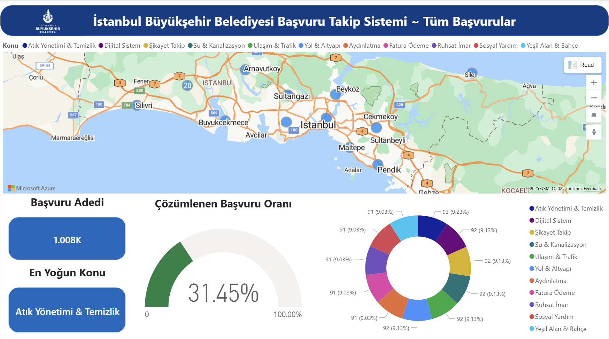

# ibb-hackathon-2025
Yapay Zeka Destekli Başvuru Takip Platformu
# İstanBuilders Complaint Classification System

Bu proje, **İBB Tech Istanbul Yapay Zeka Hackathonu (Aralık 2025)** kapsamında **IstanBuilders** ekibi tarafından 32 saatlik kesintisiz bir maraton sürecinde geliştirilmiştir. Projemiz, "Akıllı Şehir" teması altında, var olan belediye hizmetlerinin yapay zeka ile iyileştirilmesi vizyonuna odaklanmıştır.

## 📋 Problem Tanımı & Çözüm Vizyonu

İstanbul Büyükşehir Belediyesi'ne gelen vatandaş şikayetlerinin manuel olarak yönlendirilmesi; zaman alıcı, hataya açık ve maliyetli bir süreçtir. Doğru kategorizasyon, belediye hizmet verimliliği için kritiktir.

**IstanBuilders olarak çözümümüz:**

* **Otomatik Sınıflandırma:** Gelen serbest metin şikayetlerini semantik analiz ile otomatik olarak 12 farklı kategoriye ayırır.
* **Anlık Operasyonel Takip:** Şikayetler anlık olarak ilgili birimin PowerBI tabanlı dashboard'una düşer ve harita üzerinden lokasyon bazlı takip edilebilir.
* **Genişletilebilirlik:** Sistem, sesli şikayetler (Alo 153) veya görsel veriler üzerinde de çalışabilecek esnekliktedir.

---

## 📊 Dashboard ve İzleme Paneli

Sistemimiz, sınıflandırılan verileri gerçek zamanlı olarak görselleştirerek karar vericilere sunar.

## 1. Genel Durum İzleme (Tüm Başvurular)

İstanbul genelindeki tüm başvuruların dağılımı, en yoğun konu başlıkları ve çözüm oranları merkezi bir dashboard üzerinden izlenir.



---

## 2. Birim Bazlı ve Lokasyon Bazlı Detay (İSKİ Örneği)

Belirli bir kategoriye (örn. **Su & Kanalizasyon**) ait başvurular; harita üzerinde **nokta bazlı lokasyon**, başvuru içeriği ve durum bilgisiyle birlikte detaylı olarak analiz edilebilir.

Aşağıdaki örnekte, **Kadıköy / Göztepe** bölgesinden gelen *düşük su basıncı* şikayetleri lokasyon bazlı olarak gösterilmektedir.


---

## 🛠 Teknik Mimari

Projemizin en büyük farkı, yüksek maliyetli kapalı kaynaklı LLM'ler (ChatGPT vb.) yerine **tamamen yerel ve masrafsız** bir NLP mimarisi kullanmasıdır.

* **Model:** `emrecan/bert-base-turkish-cased-mean-nli-stsb-tr` (TurkishBERT).
* **Vektör Veritabanı:** PostgreSQL üzerinde **pgvector** eklentisi ile 768 boyutlu vektör benzerlik araması (cosine similarity).
* **Entegrasyon:** Dockerized mimari ve anlık veri aktarımı.

### 📊 Sınıflandırılan Kategoriler

Sistem, şikayetleri aşağıdaki ana departmanlara otomatik olarak yönlendirir:

1. Su & Kanalizasyon,
2. Atık Yönetimi,
3. Temizlik,
4. Ulaşım & Trafik,
5. Yol & Altyapı,
6. Yeşil Alan & Bahçe,
7. Aydınlatma,
8. Sosyal Yardım,
9. Fatura & Ödeme,
10. Başvuru & Ruhsat,
11. Şikayet Takip,
12. Dijital Sistemler.

---

## 🚀 Kurulum ve Çalıştırma

### 1. Veritabanını Başlatın (Docker)

PostgreSQL 16 ve pgvector eklentisini içeren container'ı ayağa kaldırın:

```bash
docker-compose up -d

```

### 2. Bağımlılıkları Yükleyin

```bash
pip install sentence-transformers transformers scikit-learn pandas matplotlib seaborn numpy psycopg2-binary pgvector

```

### 3. Notebook'u Çalıştırın

`istanbuilders_final.ipynb` dosyasını çalıştırdığınızda sistem otomatik olarak BERT modelini yükler, verileri vektörize eder ve PostgreSQL'e aktarır.

---

## 🏗 Veritabanı Şeması

* **`departments`**: Kategori tanımları.
* **`complaints`**: Ham metin, tahmin edilen kategori ve güven skoru.
* **`complaint_embeddings`**: Hızlı semantik arama için `vector(768)` tipindeki embeddingler.

---

## 👥 Ekibimiz: IstanBuilders

* **Rana İşlek**
* **Yiğit Gümüşlü**
* **Zeynep Sıla Kaya**

---

**İBB Tech Istanbul 2025**
